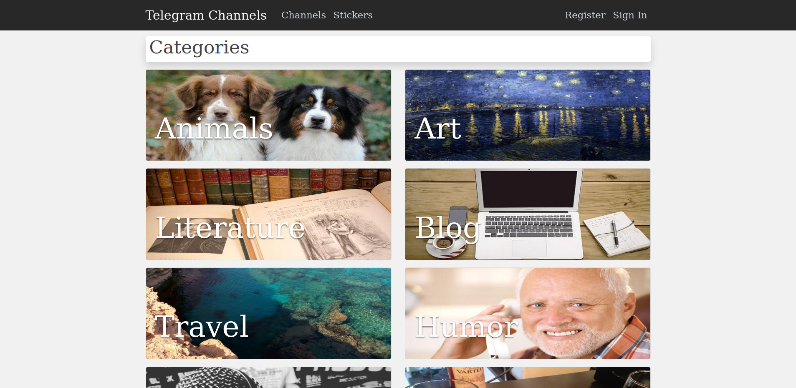
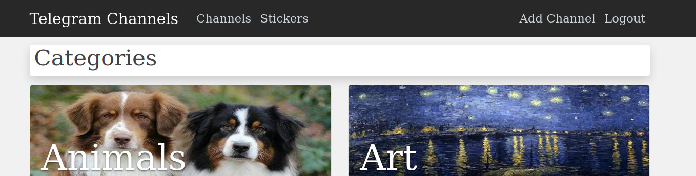
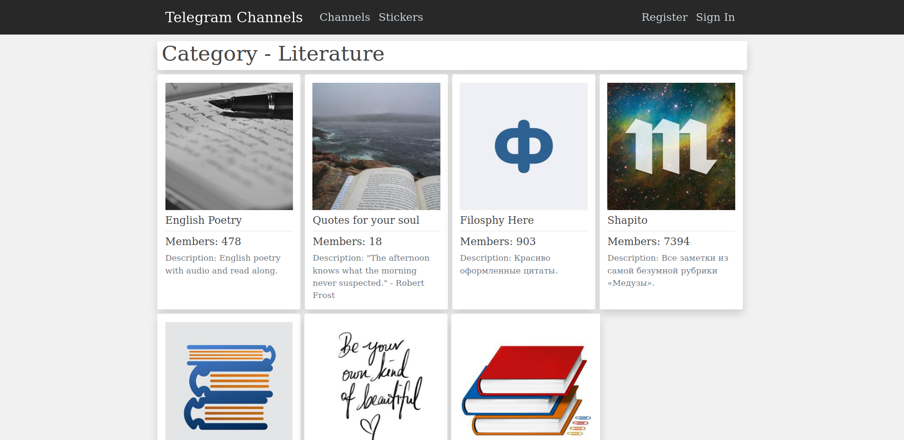
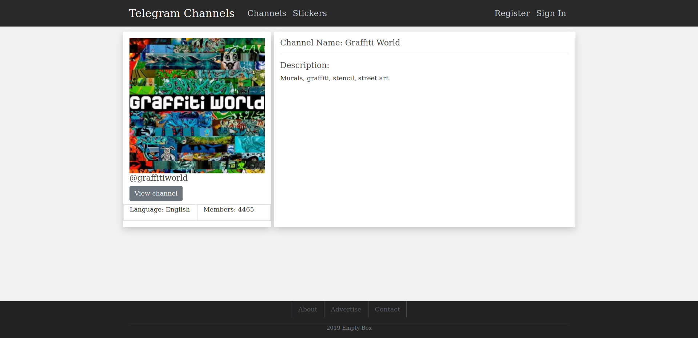
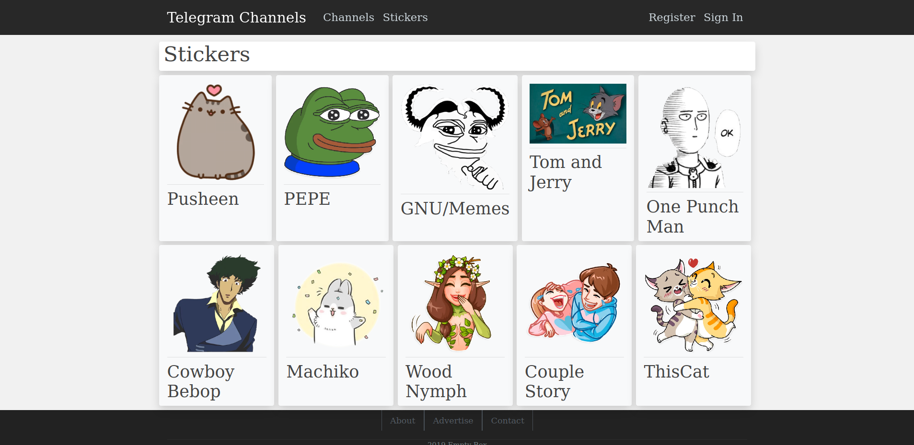
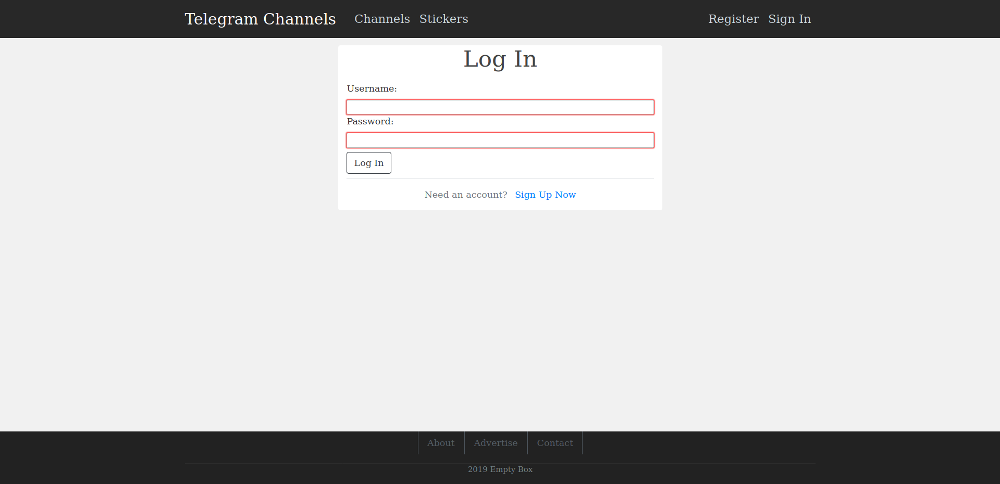
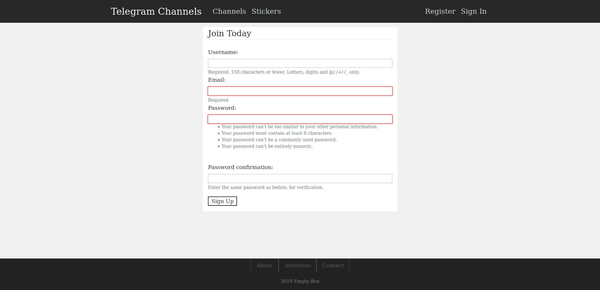
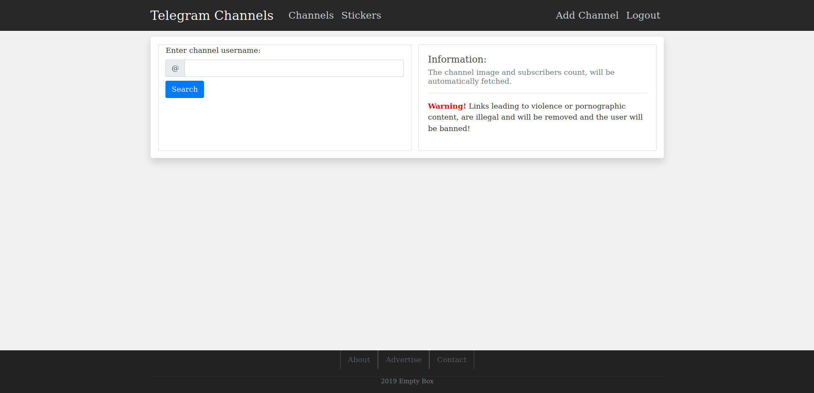
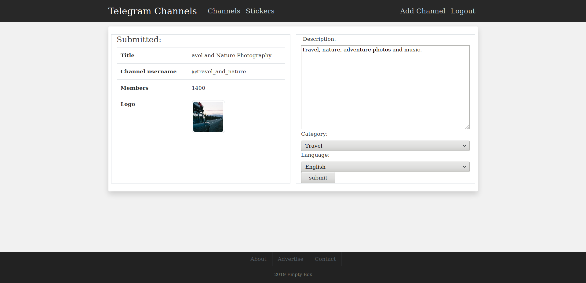
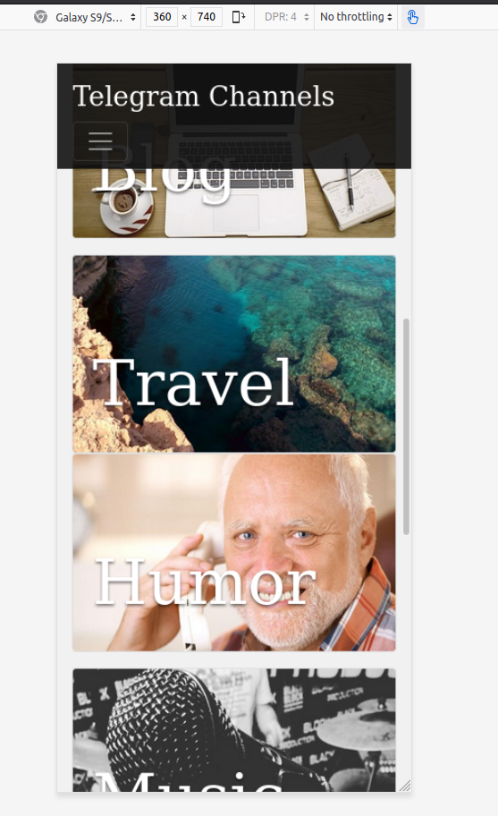

# Telegram Channels Repository
I started this project as a means to learn how to create a complete full stack web app from scratch, inculding frontend, backend and deployment.

While trying to think of ideas for the web app, I noticed that at the time Telegram didn't have a channel repository of their own,so I decided to write a web app that would let users register their channels on it. And with a quick search though the resitery other people might find channels that interest them.

## Web App Functionality
* Login/Registration
* Email activation link
* Telegram channels metadata scraping and parsing
* Auto fill in forms
* Responsive thanks to bootstrap
* Different categories of channels

## Screenshots

|||
|--|--|
|Home page:||
|Logged in top bar view: ||
|Channels page:|
|Channel details page:|
|Stickers page:|
|Log in page:|
|Register page:|
|Search for channel, by typing in the the channel username:|
|Add the channel after most of the data was prepopulated:|
|Thanks to bootstrap, the app has a responsive design:|
